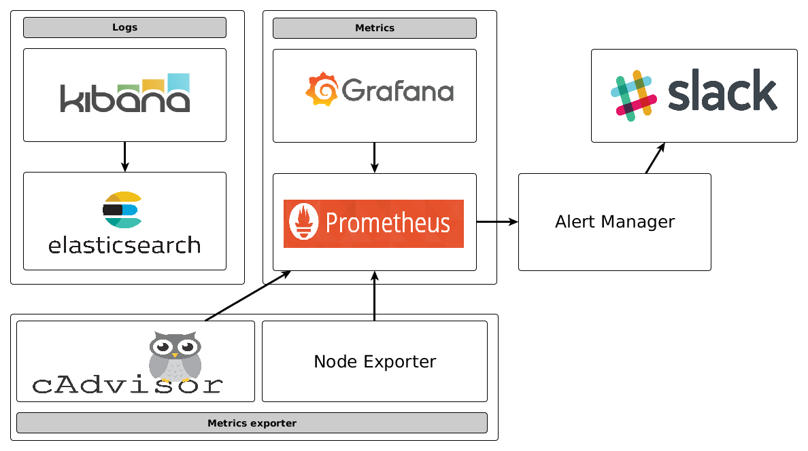

# Monitoring platform

A set of docker-compose/docker-cloud definitions of monitoring services



| service        | usage |  description   |
|----------------|-------|--------|
| ElasticSearch  | logs  | search & analytics engine   |
| Kibana         | logs  | data visualization platform  |
| Prometheus     | metrics/alerts | monitoring and alerting  platform |
| Grafana        | metrics        | querying and visualizing time series and metrics |
| CAdvisor       | metrics        | Analyzes resource usage and performance characteristics of running containers |
| AlertManager   | alerts         | Alert maanger for prometheus |
| NodeExporter   | metrics        | Metrics exporter for prometheus |

## Log platform

Edit your own configuration in `log-platform/vars-template` :

```
cd log-platform
source vars-template
./sourcing.sh
```

Default https configuration require : 
* a `keystore.jks` in `log-platform/elasticsearch/shield/ssl` directory
* a public/private key pair in `log-platform/key` directory matching the path defined in `vars-template`

### Log platform - docker-compose 

```
docker-compose up
```

### Log platform - docker-cloud

```
docker-cloud stack create --name log-platform -f stackfile.yml
docker-cloud stack start log-platform
```

## Metrics platform

Edit your own configuration in `metrics-paltform/vars-template` :

```
cd metrics-platform
source vars-template
./sourcing.sh
```

Default https configuration require : 
* a public/private key pair in `metrics-platform/key` directory matching the path defined in `vars-template`

### Metrics platform - docker-compose 

```
docker-compose up
```

### Metrics platform - docker-cloud

```
docker-cloud stack create --name metrics-platform -f stackfile.yml
docker-cloud stack start metrics-platform
```